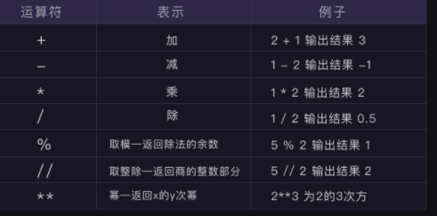

**类型：**

1.字符串（string  -  str）：

    类型有：现实的词，语句，表达式  

    必须有引号否则报错
    有引号的是字符串，没有的是整数

2.整数（integer  -  int）:  

    不带小数点的数字，正负都可

3.浮点数（float）:  

    带小数点的数字，运算结果存在误差


**应用：**

四则运算：符号




    XX += 1   #意思是XX =XX+1

字符串拼接：

    类型相同 +号拼接

数据类型的查询——type()函数

	例：print(type('查询的内容'))
	
	
	
**数据转换：**

`Str()`函数：将其他数据类型转换成字符串   （也可用引号转换）

```python
	例：number = 153，code = '通行密码'
		print(who+destination+code+action+str(number))
```
`Int()`函数：将其他数据类型转换成整数   (直接抹零不做四舍五入处理)

```python
		例：number1 = '6'     number2 = '1'
		       print(int(number1)+int(number2))
		浮点形式的字符串（  print(int('3.8'))  ）不能转换，浮点数(  print(int(3.8))  )可以
```
`Float()` 函数：将其他数据类型转换成浮点数  （字符串也可，除文字类字符串😅）