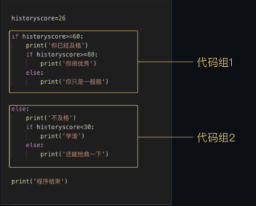

**条件判断：**

单项判断   `if:`

#条件后记得跟进英文冒号，回车后自动缩进

```python
		if XXXX ：
		缩进 print()
```

双向判断  `if…else… :`

```python
		if XXXX :
			Print(XXXX)
		else:
			print(XXXX)
```
多项判断  `if…elif…else… :`

```python
		if XXXX :
			Print(XXXX)
		elif XXXX:  #条件1不满足执行
			Print(XXXX)
		elif XXXX:  #同上
			Print(XXXX)
		else:   #以上条件都不满足后执行
			Print(XXXX)
```
		
**if嵌套：**

	if嵌套执行顺序：       
		#根据层级执行
		#缩进相同的命令同等级，一条一条处理
			1.先赋值
			2.代码组1——不满足60直接跳到代码组2
			3.代码组2——代码组1未满足执行

<div align="center">

