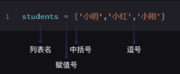
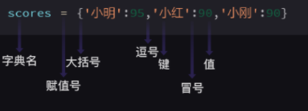
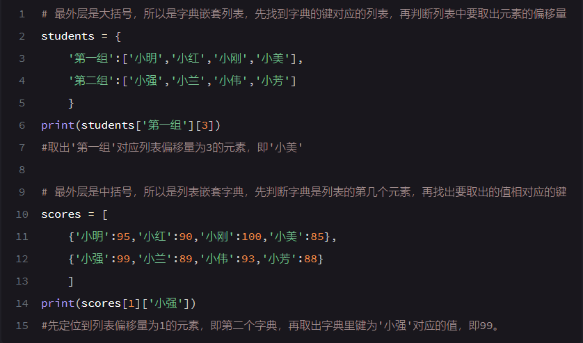

**列表：**




    #列表内偏移量起始值为0

提取单个元素：
```python
		A = [01,02,03]
		Print(a[0])
```
提取多个元素: 

    切片口诀：左右空，取到头；
            左取右不取    #冒号是切片
```python
		A = [1,2,3,4,5]
		Print(a[:]) #打印出[1，2，3，4，5]
		Print(a[2:]) #[3，4，5]
		Print(a[:2]) #[1，2]
		Print(a[1:3]) #[2，3]
		Print(a[2:4]) #[3，4]
```
列表添加/删除元素：

		添加：append()函数
			用法：   列表名.append()
			注：每次只能增加一个元素
			
		删除：del 语句
			用法： del 列表名[元素的索引（偏移量）]
			
**数据类型：字典**  

     #与列表不同处：大括号




	字典里的元素由 键值对 组成   
		#例：'小明':95  '小明' 叫键（key）95叫值（value）
		字典里一样的键的键值对，后面的会覆盖前面
	
`Len()函数` #查询字典或列表长度（元素个数）
```python
		例：a = ['5','6','7','8']
		         b = {'明':12'刚':13'王':14}
		         print(len(a))   #结果3
		         print(len(b))   #结果3
```

	增加键值对：
		字典名['XXX'] = 值
			例：字典1['psp'] = 'ppspp'
	删除键值对：
		Del 字典名[键]
			例：del 字典2['03']
		
字典与列表的异同

	不同点：列表中元素位置明确，即使元素相同

	相同点：1.修改元素都可用赋值语句完成
		      2.支持任意嵌套
	             互相嵌套例：





**元组tuple** 

	用小括号包，其他与列表一样

```python
	例：
		tuple1 = ('A','B')
		list2 = [('A','B'),('C','D'),('E','F')]
		print(tuple1[0])      #结果：A
		print(list2[1][1])      #结果：D
```